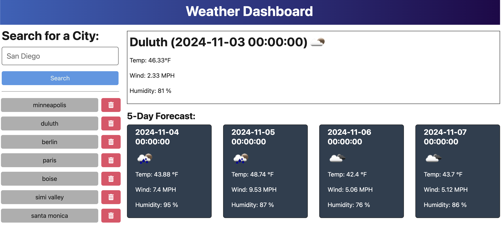

# Weather Dashboard

[](https://opensource.org/licenses/MIT)

## Description

The Weather Dashboard application fetches weather data via OpenWeather's API, allowing users to search for a city and see its weather forecast. Each city is saved to a search history list so that users can easily navigate between their favorites. Cities can be individually deleted from the search history. 

This project was an exercise in retrieving API data using HTTP requests, routing the request through a back end server, and rendering the retrieved data to a webpage. 

## Installation

The application is [deployed live via Render](https://weather-dashboard-yntg.onrender.com/). 

If you'd like to download and test the application files locally, you will first need to get an API key from OpenWeather and use it as an environment variable in a .env file. 

The repository can be downloaded using:

```
git clone https://github.com/mikelind28/weather-dashboard.git
```

You'll have to install the package dependencies from the weather-dashboard directory using:

```
cd weather-dashboard
npm install
```

You can test the application using ```npm run start:dev``` from the weather-dashboard directory after you've added a .env file with an API key and base URL. Vite will open it in your browser using a local host.

## Usage

The application is easy to use—just type in a city name, click search, and see the results! Delete a city from the search history list by clicking the red trashcan icon next to its name.




## Credits

A lot of the starter code was provided by EdX Coding Bootcamp course via the University of Minnesota. I filled in some server-side functions to fetch the API data from OpenWeather and connect the application's front end to the back end.

## License

This project uses an [MIT License ↗️](./LICENSE.txt).
